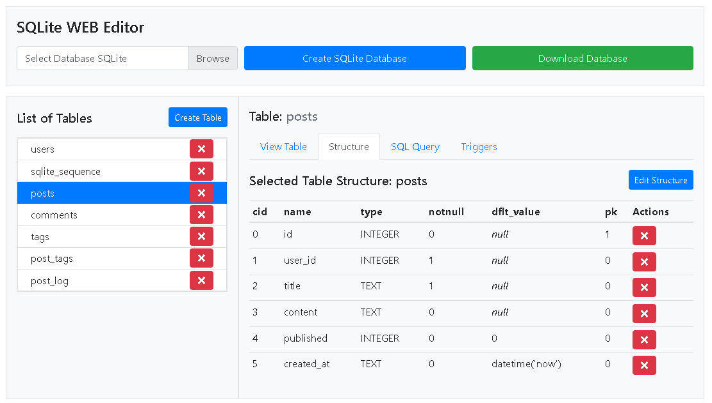

# 🗄️ SQLite WEB Editor

👉 **[Try the online demo here](#)**  
*(Demo link goes here)*

---

<p align="center">
  
</p>

## 🚀 Overview

**Web SQLite Editor** is a **100% client-side SQLite database editor** that runs entirely in your browser.  
No servers. No backend. No installation. No uploads.

Everything happens locally using **pure JavaScript**.

Your data **never leaves your computer**.

---



## 🔐 Security & Privacy

- ✅ 100% browser-side execution
- ✅ No data is sent to any server
- ✅ Works fully offline after loading
- ✅ Uses `sql.js` (SQLite compiled to WebAssembly)

If you can open a web page, you can safely edit SQLite databases.

---

## ✨ Features

- 📂 Open **any existing SQLite database** (`.sqlite`, `.db`, `.sqlite3`)
- 🆕 Create **new in-memory databases**
- 🧱 Create, edit, and delete **tables**
- ✏️ Insert, update, and delete **records**
- 🧬 Modify **table structure** (columns, types, constraints)
- 🔑 Full support for **Primary Keys**, including **composite PKs**
- ⚡ Execute **custom SQL queries**
- 🔁 Create and manage **SQLite triggers**
- 📊 Browse large tables efficiently
- 🌐 100% web-based — no installation required

---

## 🛠️ How It Works

The editor uses:

- **sql.js** (SQLite compiled to WebAssembly)
- **Pure JavaScript**
- **HTML + CSS**
- Runs entirely in the browser memory

Databases can be:
- Loaded from a local file
- Created empty in memory
- Exported back to a SQLite file

---

## 📦 Installation

There is **nothing to install**.

Just clone the repository and open `index.html`:

```bash
git clone https://github.com/sysmaya/SQLite-web-Editor.git
cd web-sqlite-editor

